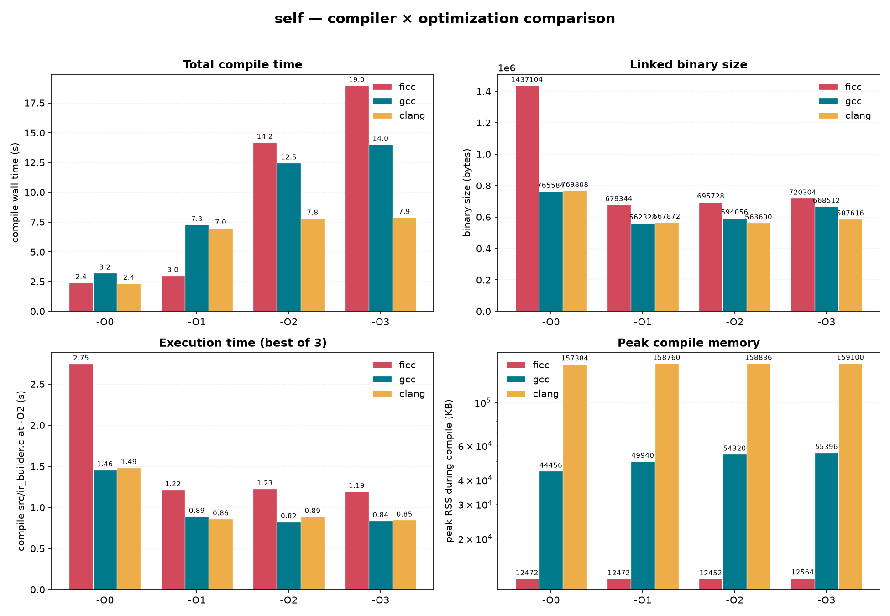
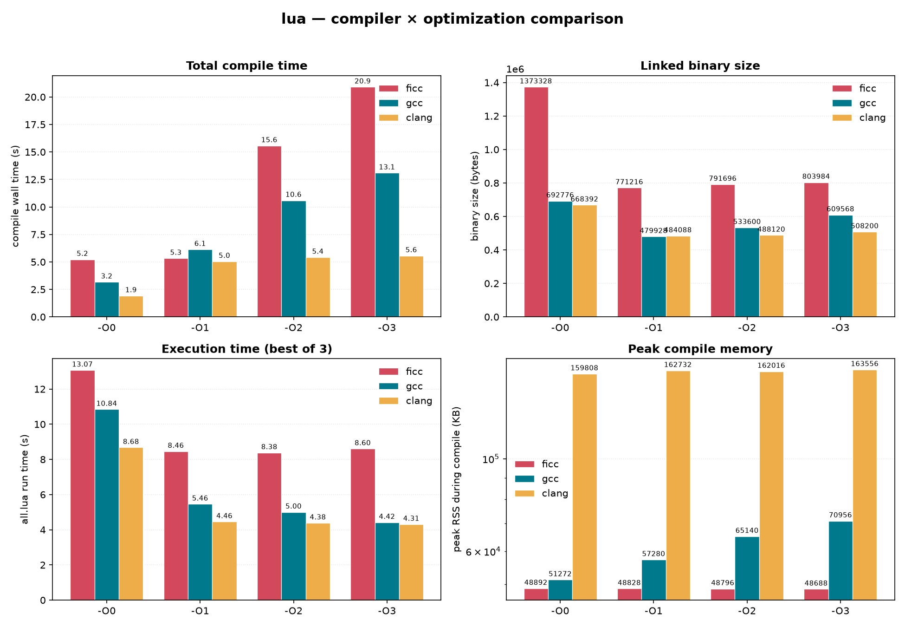

# ficc

A small optimizing C11 compiler for x86-64 Linux.

ficc is a single C program: it preprocesses, parses, type-checks, optimizes,
allocates registers, encodes x86-64, writes ELF objects and executables, emits
DWARF, and links. It compiles itself and several real programs (lua, sqlite,
libpng, zlib, git), each passing its own test suite. It is developed with AI
assistance; see the [AI notice](#ai-notice).

## Compiling real software

`make external` fetches each project at a pinned revision, builds it with ficc,
and runs the project's own test suite:

| Project | Revision | Suite |
|---------|----------|-------|
| Lua | v5.5.1 | `testes/all.lua` |
| zlib | `767c4c9` | round-trip tests |
| libpng | `964b413` | `pngtest` / `pngvalid` / `pngstest` |
| Git | v2.56.0-rc2 | full `t/` + clar |
| SQLite | `2acb2ea` | TCL suite |

SQLite's result is compared against the same host-gcc baseline (two platform
failures are shared with gcc).

## Benchmarks

ficc vs gcc vs clang on the Lua interpreter and on ficc's own source, across
`-O0` - `-O3`. Panels: total compile time, linked binary size, execution time,
peak compile RSS.


<sub>NOTE: the execution-time panel times a freshly built ficc compiler binary, 
produced by the labeled compiler, running the same command on
the same input: `ficc -O2 -I src -c src/ir_builder.c`.</sub>



<sub>Benchmark analysis measured at commit `0c5eb62`.</sub>


The `-O2` and `-O3` passes add little over `-O1` in size or runtime; most of
the win is at `-O1`, and the higher levels mostly cost compile time (see
[Optimizer](#optimizer)).

## Build

```sh
make            # build/bin/ficc
make test       # unit + end-to-end tests
make selftest   # bootstrap; stage1 and stage2 objects must be byte-identical
make external   # build lua zlib libpng git sqlite with ficc and run their tests
```

## Usage

The CLI is modeled after gcc/clang.

```sh
ficc hello.c -o hello          # compile and link
ficc -O2 -c foo.c -o foo.o     # object file
ficc -E foo.c                  # preprocessed source
ficc -run foo.c                # run in the IR interpreter
ficc -g -ir foo.c              # dump the IR (also -tokens, -pp, -ast)
```

Run `ficc --help` for the full option list.

## Dev dependencies

Building ficc needs only `gcc` (stage-0 bootstrap) and `make`; the compiler has
no runtime dependencies. `bear` is optional and only generates
`compile_commands.json` (`COMPILE_COMMANDS=0` disables it).

The tests and `make external` pull in more:

- `make test`: `gcc` (link/correctness oracle)
- `make selftest`: `gcc` (stage 0) only
- `make bench`: host `cc`, `awk`, `stat`, `mktemp`, `timeout`; GNU `time`
  (`/usr/bin/time`) for the Lua timing
- `make external`: `git`, `bash`, `make`, `xargs`, `sort`, `wc`, `awk`,
  `grep`, `sed`, `tr`, `cmp`, `diff`, `mktemp`, `timeout`, `nproc`, plus
  `tclsh` (SQLite) and `gcc` (Git/SQLite link fallback and the SQLite
  baseline). `systemd-run` is optional, used to cap memory while building
  SQLite.
- `make test-gdb` (optional): `gdb`, `readelf`, `awk`, `grep`

## C11 support

Supported:

- the C11 core: integer and floating types, `_Bool`, pointers, arrays, structs,
  unions, enums, `typedef`, `sizeof`, `_Alignof`, `_Alignas`, `_Static_assert`
- full control flow, expressions, storage classes, function pointers
- the full C11 preprocessor (macros, `#`/`##`, conditionals, digraphs, `_Pragma`,
  `#include_next`, `__has_include`)
- `float`/`double` on SSE2 and 80-bit `long double` on x87
- `_Generic`, compound literals, designated initializers, flexible array
  members, bit-fields, anonymous struct/union members
- wide and UTF-8 string/char literals (`L`, `u`, `U`, `u8`)
- variadic functions via `__builtin_va_*`
- `__attribute__((packed/aligned/constructor/destructor))`; unknown attributes
  are ignored (pedantic warns)
- `register`/`auto`/`_Noreturn` are accepted; `register` has no codegen effect

Not supported:

- atomics (`_Atomic`, `<stdatomic.h>`)
- threads / `_Thread_local` / TLS
- `_Complex`
- variable-length arrays
- inline `asm`/`__asm__` (parsed and warned, not emitted)
- GNU `typeof`/`__typeof__` and statement expressions
- universal character names (`\uXXXX`)
- K&R function definitions

## Pipeline

```
source -> preprocessor -> tokens -> parser -> AST -> semantic -> SSA IR
       -> optimizer -> register allocator -> x86-64 encoder -> ELF
       -> loader/linker (static or dynamic)
```

The IR also has an interpreter, used as a test oracle: for a given program the
interpreter result must match the compiled ELF result.

Everything lives in-tree:

- preprocessor (full C11, in-house), lexer, parser, semantic analyzer
- register-based SSA IR with phi nodes
- optimizer (`src/optpasses/`)
- linear-scan register allocator with live-range splitting at calls
- x86-64 instruction selection + encoder (no assembler)
- DWARF4 debug info and `.eh_frame` CFI (`-g`)
- ELF64 writer plus an in-tree static/dynamic linker (`filc`)
- builtin freestanding headers (`include/`)

Output is deterministic: no timestamps, no absolute paths, sorted symbol and
relocation tables.

## Optimizer

The optimizer mutates the SSA IR to a fixpoint under an iteration budget. Each
pass is one file in `src/optpasses/` and returns whether it changed the IR.
Levels are strictly nested.

`-O1` - cheap local scalar cleanup:

| Pass | Effect |
|------|--------|
| `canon` | canonicalize operand order and immediates for cheaper encodings |
| `fold_const` | constant-fold integer/FP binops and comparisons |
| `identity` | algebraic identities (`x+0`, `x*1`, `x-x`, `x/1`, ...) |
| `cast` | drop no-op casts, fold truncated immediates |
| `cprop` | copy propagation |
| `phi_simp` | collapse trivial phi nodes |
| `dce` | dead code elimination |
| `cfg_clean` | remove unreachable and empty blocks |

`-O2` adds loop structure, inlining, and global/value passes:

| Pass | Effect |
|------|--------|
| `preheader` | canonical loop form (preheaders, single latch) |
| `inline` | size-filtered, budgeted inlining with a loop discount |
| `gvn` | dominance-based global value numbering (integer/pointer CSE) |
| `licm` | loop-invariant code motion, including invariant loads |
| `mem_fwd` | store-to-load forwarding on alloca-derived slots |
| `strength` | `*2^k -> shl`, `u/2^k -> lshr`, `u%2^k -> and` |
| `dse` | dead store elimination |

`-O3` adds reassociation, unrolling, and a wider inlining budget:

| Pass | Effect |
|------|--------|
| `reassoc` | reassociate constant addends and products |
| `unroll` | fully unroll small counted loops (constant trip count 1-8) |
| `partial_unroll` | unroll runtime-bound counted loops by 4, with an `INT_MIN` guard |

Dead-function elimination runs after the fixpoint loop. There is no alias
analysis yet, so memory passes are conservative: `mem_fwd` is equality-only on
alloca slots, `dse` proves a store dead only when its slot is never read and
never escapes, and `licm` hoists a load only from a loop with no writes.
`FICC_SKIP_PASSES`, `FICC_OPT_TRACE`, and `FICC_OPT_MAX_ITER` are debug hooks.

## Codegen

The target-neutral SSA IR is the only IR before machine code; there is no
separate machine IR.

Register allocation is a deterministic linear scan, one register class at a
time (GPR, then XMM), after instruction-granularity live intervals:

- farthest-end eviction when a register is needed (Poletto-Sarkar)
- argument registers are used as allocation hints
- a value live across a call goes to a callee-saved register or is split at
  each call boundary with a reload
- values under pressure are split at their next use
- `alloca` and constant-offset GEPs are rematerialized instead of kept in a
  register or spill slot

Pattern folding lives in the lowerer (there is no separate peephole pass):

- GEP chains fold into base + displacement addressing
- `gep(base, index, scale)` folds into x86 SIB addressing
- a single-use compare feeding a branch becomes flags + `jcc`
- redundant zero-extension is dropped (32-bit ops already zero-extend to 64)
- dense switches become in-`.text` jump tables; others become compare chains
- multiply by a power of two becomes a shift

Frame and ABI:

- System V AMD64 eightbyte classification (`abi.c`), register/stack arguments,
  aggregate copies, `sret` returns
- variadic register save area with `%al` vector count
- 16-byte call alignment; the frame pointer is omitted when possible
- `long double` on x87, passed on the stack and returned in `%st0`

With `-g`, ficc emits DWARF4 line info, DIEs for subprograms, globals, types,
parameters, and address-not-taken locals (per-segment `.debug_loc`), plus
`.eh_frame` CFI.

## Future work

- a machine IR (MIR) between SSA and encoding, with its own passes
  (peephole, instruction combining, scheduling)
- a stronger register allocator: live-range splitting first, later a
  graph-coloring/coalescing allocator
- alias/memory analysis to strengthen GVN, LICM, `mem_fwd`, and `dse`
- inline `asm`
- an integrated assembler and a disassembler
- `-S` output
- `_Complex`, atomics, and threads
- try to compile linux? 

## AI notice

ficc is written with AI assistance. I use [opencode](https://opencode.ai), here's my setup:

- **model**: DeepSeek V4.1 Flash
- **knowledge base**: a local Qdrant vector store (MCP) holding the C11, ELF,
  psABI, DWARF, Intel SDM, and assembler references below
- **LSP servers**: `clangd` and `bash-language-server`

I set the design, architecture, phase plans, and reviews, and wrote a good share of the
non-boilerplate code; the model carries most of the routine implementation.

## References

Standards and specifications:

- ISO/IEC 9899:2011 (C11): [N1570 draft](http://www.open-std.org/jtc1/sc22/wg14/www/docs/n1570.pdf)
- System V ABI, AMD64 supplement (x86-64 psABI): [gitlab.com/x86-psABIs/x86-64-ABI](https://gitlab.com/x86-psABIs/x86-64-ABI)
- DWARF Debugging Information Format: [dwarfstd.org](https://dwarfstd.org/)
- Tool Interface Standard (TIS) ELF 1.2: [refspecs.linuxfoundation.org/elf/elf.pdf](https://refspecs.linuxfoundation.org/elf/elf.pdf)
- Intel 64 and IA-32 Architectures Software Developer's Manual, Vol. 2: [intel.com/sdm](https://www.intel.com/sdm)
- GNU Assembler manual: [sourceware.org/binutils/docs/as](https://sourceware.org/binutils/docs/as/)
- The C Preprocessor (GCC): [gcc.gnu.org/onlinedocs/cpp](https://gcc.gnu.org/onlinedocs/cpp/)

Papers:

- Massimiliano Poletto and Vivek Sarkar. *Linear Scan Register Allocation*.
  ACM TOPLAS 21(5), 1999.
- Matthias Braun, Sebastian Buchwald, Sebastian Hack, Roland Leissa, Christoph
  Mallon, and Andreas Zwinkau. *Simple and Efficient Construction of Static
  Single Assignment Form*. CC 2013.

Projects:

- chibicc: [github.com/rui314/chibicc](https://github.com/rui314/chibicc)

## License

[MIT](LICENSE)
